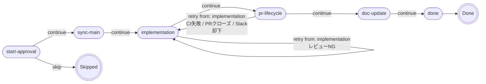

# autopilot

ObsidianのVaultを監視し、ストーリーのステータスが `Doing` になると Claude エージェントが自動でタスクを実行する自律ワークフローボットです。各ステップの開始・完了はSlackで承認できます。

## 動作の流れ

1. Obsidian VaultのストーリーファイルのStatusを `Doing` に変更する
2. タスクファイルが存在しない場合、Claudeがストーリーを分解してタスク候補をSlackに提示
3. 承認するとタスクファイルが作成され、順番に実行が始まる（キャンセルするとストーリーのステータスが `Cancelled` になり停止する）
4. 各タスクの開始・完了時に承認を求める（やり直しも可能）
   - Slackバックエンドの場合: ストーリーごとに独立したスレッドで通知・承認が管理される
   - 「マージ準備完了」通知にはNGボタンがあり、Slack上で理由を入力してPRを却下できる（却下理由は次の実装に自動反映される）
   - **タスクが失敗した場合**、自動で次のタスクへは進まず、Slackにボタン付き通知が届く。ユーザーは以下から選択する:
     - **リトライ**: タスクをTodoに戻して再実行
     - **スキップして次へ**: タスクをSkipped扱いにして次のタスクへ進む
     - **ストーリーをキャンセル**: ストーリーをCancelledにして終了
5. 全タスク完了後、READMEの更新が必要か自動判定される
   - 処理フロー変更・新機能追加など更新が必要な場合、`docs/story-[slug]` ブランチでPRが作成され、レビュー・マージを待機する
   - リファクタのみ等で更新不要と判断した場合はスキップされる
6. ストーリーのStatusが更新され通知（全タスクがDone/Skippedなら `Done`、Failedタスクがあれば `Failed`、キャンセルされた場合は `Cancelled`）

## タスク実行エンジン：Pipeline パターン

### 設計思想

> **「フローがコードを読めばグラフとして見える」**

`runTask` は **Pipeline パターン** で実装されています。タスクの実行フロー全体が `createPipeline([...])` の1箇所に宣言されており、コードを読むだけでグラフとして把握できます。

```typescript
// src/pipeline/task-pipeline.ts ← フロー定義の唯一の場所
export const taskPipeline = createPipeline<TaskContext>([
  step('start-approval',  handleStartApproval),  // タスク開始を Slack で承認
  step('sync-main',       handleSyncMain),        // main ブランチと同期
  step('implementation',  handleImplementation),  // Claude Agent で実装 + セルフレビュー
  step('pr-lifecycle',    handlePRLifecycle),      // PR 作成 + CI + 手動マージ待機（ポーリング / Slack NG却下）
  step('doc-update',      handleDocUpdate),        // Vault ストーリーノートへ why 記録
  step('done',            handleDone),             // 完了通知 + ステータス更新
]);
```

### フロー図



### FlowSignal

各 step は処理結果を **FlowSignal** として返します。「次に何が起きるか」を step 自身が宣言し、ループ制御は Pipeline が担います。

| シグナル | 意味 | 発生例 |
|---|---|---|
| `continue` | 次の step へ進む | 正常完了 |
| `retry(from, reason)` | 指定 step まで巻き戻す | CI失敗 → `from: 'implementation'`<br>PRクローズ → `from: 'implementation'`<br>Slack却下 → `from: 'implementation'`（却下理由付き） |
| `skip` | Pipeline を即終了（Skipped 扱い） | タスク開始承認で却下 |
| `abort(error)` | エラーを throw して強制終了 | 致命的エラー |

### retry の明示性

retry 先を `from:` フィールドで宣言するため、**「どこまで巻き戻るか」の意図がコードから直接読めます**。

```typescript
// CI失敗 → 実装からやり直し（コードを直して再実装が必要）
return { kind: 'retry', from: 'implementation', reason: `CI未通過: ${ciResult.finalStatus}` }

// PRがマージされずクローズ → 実装からやり直し
return { kind: 'retry', from: 'implementation', reason: `PRクローズ: ${reason}` }
```

### 実装ファイル構成

```
src/pipeline/
├── types.ts           # FlowSignal / TaskContext / Step の型定義
├── runner.ts          # createPipeline / step / createTaskContext の実装
├── task-pipeline.ts   # 6 step のフロー定義（← ここがグラフ）
└── steps/
    ├── start-approval.ts  # handleStartApproval
    ├── sync-main.ts       # handleSyncMain
    ├── implementation.ts  # handleImplementation（Agent 実行 + レビュー）
    ├── pr-lifecycle.ts    # handlePRLifecycle（PR + CI + 手動マージ待機）
    ├── doc-update.ts      # handleDocUpdate（Vault why 記録）
    └── done.ts            # handleDone
```

---

## セットアップ

### 1. 依存パッケージのインストール

```bash
npm install
```

### 2. `.env` の作成

```bash
cp .env.example .env
```

`.env` の内容:

```env
# ObsidianのVaultのローカルパス
VAULT_PATH=/path/to/your/obsidian/vault

# 監視するVaultのプロジェクト名（Projects/{WATCH_PROJECT}/stories/ を監視する）
WATCH_PROJECT=my-project

# 通知・承認バックエンド（省略時は local）
# local: macOS通知 + ターミナル承認（Slack不要）
# slack: Slack経由（SLACK_BOT_TOKEN等が必要）
# ntfy: ntfy.sh経由のプッシュ通知（NTFY_TOPICが必要）
NOTIFY_BACKEND=local

# Slack Bot Token（xoxb-...）※ NOTIFY_BACKEND=slack の場合のみ必要
SLACK_BOT_TOKEN=xoxb-...

# Slack App-Level Token（xapp-...）※ NOTIFY_BACKEND=slack の場合のみ必要
SLACK_APP_TOKEN=xapp-...

# 通知・承認に使うSlackチャンネルID ※ NOTIFY_BACKEND=slack の場合のみ必要
SLACK_CHANNEL_ID=C0XXXXXXXXX

# ntfy.shのトピック名 ※ NOTIFY_BACKEND=ntfy の場合のみ必要
# NTFY_TOPIC=my-autopilot

# リポジトリのベースディレクトリ（省略時は ${HOME}/dev）
# REPO_BASE_PATH=/path/to/your/repos
```

### 3. 通知バックエンドの選択

`NOTIFY_BACKEND` 環境変数で通知・承認の受け取り方を切り替えられます。

| バックエンド | 説明 | 追加設定 |
|---|---|---|
| `local`（デフォルト） | macOSシステム通知 + ターミナルでy/n承認 | 不要 |
| `slack` | Slackメッセージ + ボタン承認（非同期対応） | Slack App設定が必要（下記参照） |
| `ntfy` | [ntfy.sh](https://ntfy.sh) 経由のプッシュ通知 | `NTFY_TOPIC` が必要 |

Slackバックエンドを使う場合のみ、以下の設定が必要です。

### 4. Slack Appの設定（NOTIFY_BACKEND=slack の場合のみ）

[api.slack.com/apps](https://api.slack.com/apps) で新規Appを作成し、以下を設定します。

**Socket Modeを有効化**
- "Socket Mode" メニューから有効化
- App-Level Token（スコープ: `connections:write`）を生成 → `SLACK_APP_TOKEN`

**Bot Token Scopesの追加**（"OAuth & Permissions"）
- `chat:write`
- `im:write`
- `channels:read`

**Interactivityを有効化**（"Interactivity & Shortcuts"）

**スラッシュコマンドを登録**（"Slash Commands"）
- "Create New Command" をクリック
- Command: `/ap`
- Short Description: `autopilot操作`
- Usage Hint: `status | retry <task-slug>`
- 保存後、Appを再インストール

**Appをワークスペースにインストール** → `SLACK_BOT_TOKEN`

**Botをチャンネルに招待**
```
/invite @YourBotName
```

### 5. 起動

```bash
# 開発モード
npm run dev

# ビルドして実行
npm run build
node dist/index.js
```

## `/ap` コマンド

Slackから autopilot を操作できます。

> **前提**: `/ap` コマンドは `NOTIFY_BACKEND=slack` の場合のみ動作します。
> `.env` に `NOTIFY_BACKEND=slack` を設定し、`npm run dev` または `node dist/index.js` が起動中であることを確認してください。

| コマンド | 説明 |
|---|---|
| `/ap status` | 実行中のストーリー・タスク一覧を表示 |
| `/ap retry <task-slug>` | 失敗タスクをTodoに戻して再実行 |

例:
```
/ap status
/ap retry my-feature-task-01
```

## Vaultのファイル構造

autopilot は Obsidian Vault 内の以下のディレクトリ構造を前提としています。

```
Projects/
  {project}/              ← WATCH_PROJECT で指定するプロジェクト名
    stories/
      my-story.md         ← ストーリーファイル（status を Doing にすると実行開始）
    tasks/
      my-story/           ← ストーリー名と同名のディレクトリ
        01-task-a.md      ← タスクファイル（Claudeが自動生成、アルファベット順に実行）
        02-task-b.md
```

また、autopilot は Claude エージェント実行時にリポジトリのパスを `{REPO_BASE_PATH}/{project}`（`REPO_BASE_PATH` 未設定の場合は `~/dev/{project}`）として解決します。デフォルト以外の場所にリポジトリがある場合は `.env` に `REPO_BASE_PATH` を設定してください。

### ストーリーファイルの例

```markdown
---
status: Doing
---

## 概要
認証機能を実装する

## 完了条件
- ログインAPIが動作する
- テストが通る
```

`status` を `Doing` に変更すると autopilot が検知して実行を開始します。

### タスクファイルの例（Claudeが自動生成）

```markdown
---
status: Todo
priority: high
effort: medium
story: my-story
project: my-project
created: 2025-01-01
---

# JWTトークン生成の実装

## 目的

ログイン後のセッション管理に使うトークンを発行する

## 詳細

...

## 完了条件

- [ ] トークンが正しく生成される
- [ ] テストが通る

## テスト方針

<!-- タスクごとのテスト方針を記述してください（例: 単体テストのみ、統合テストのみ、モック方針など）。未記入の場合はデフォルトのテストルールが適用されます。 -->

## メモ

```

## ローカルオンリーモード

Gitリモートが設定されていないリポジトリでは、autopilot は自動的にローカルオンリーモードで動作します。

| 通常モード | ローカルオンリーモード |
|---|---|
| 実装 → PR作成 → CI → マージ承認 → マージ | 実装 → ローカルコミットのみ |

PR作成・push・CI・レビュー通知をスキップし、ローカルコミットだけで完了します。GitHubを使わない環境や、ローカルで試したい場合に自動的に適用されます。

## テスト

コアモジュール（`vault/reader.ts`, `vault/writer.ts`, `git/sync.ts`）には単体テストがあり、外部依存なしで実行できます。Vault 系テストは `fake-vault` ヘルパーによる一時ファイルで、Git 系テストは `child_process` のモックでそれぞれ副作用を分離しています。コアモジュールのライン・ブランチカバレッジは 80% 以上を維持しています。

```bash
npm test
```

## CI（継続的インテグレーション）

PR の作成・更新時、および `main` ブランチへの push 時に GitHub Actions でテスト（`npm test`）が自動実行されます。テストが失敗した PR はマージできません。

### CI ポーラーの runs 未検出時の振る舞い

PR 作成直後は GitHub Actions のワークフローがまだキューに入っておらず、CI runs が0件になることがあります。この場合、CI ポーラーは `success` ではなく `pending`（reason: `no_runs_yet`）を返します。これにより、CI が実際に完了するまでマージ準備完了通知が送信されません。

runs が空の状態が一定回数（デフォルト: 10回、環境変数 `CI_EMPTY_RUNS_MAX_RETRIES` で変更可能）続いた場合は、CI 未設定のリポジトリとみなして `success` にフォールバックします。runs が途中で出現した場合はカウントがリセットされ、通常の CI 監視に移行します。

さらに、通知送信側でも CI ステータスが `pending` の場合はマージ準備完了通知を送信しないガード条件があります。これはポーリングループ側の制御をすり抜けた場合の二重防御として機能します。

## 常駐運用（pm2）

```bash
npm install -g pm2
npm run build
pm2 start dist/index.js --name autopilot
pm2 save
pm2 startup
```
